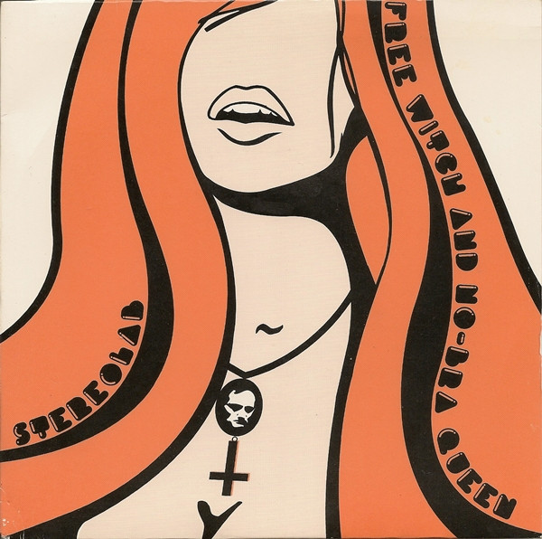

# Week 1 Assignment
Data 110

# MD Author

This is Nick Pazzaglia's attempt to get the basics of markdown with the intention of learning tools essential to becomming a faux programmer.
0
## This is an example of how you write in bold and italics (according to markdown syntax documentation, but bold is not showing up on my monitor!)

__War is Over!__

*It's going to get worse before it gets better*

## This is a list of various unrelated events

1. Religion as mind control
2. The second comming of Jesus
3. Apacolyptic death cult
4. The Waco tragedy
5. Heaven's gate suicides
6. The Jonestown Massacre
7. Order of the Solar Temple

## Here is an unordered list of death cult essentials

+ Blind loyalty
+ Koolaid
+ Jungle Juice
+ Syanide
+ Red plastic cups


An obscure album cover from the great french electronic band Stereolab. The album was created before the one of the singers died by being run over while riding her bicycle in Paris, France



## This is one of my favorite quotes in Italics

>"If you gaze long enough into an abyss, the abyss will gaze back into you" - Fredrick Nietzsche

## Every Student's first python code

`print('Hello, world!')`

```
Python is named from Monty Python and not the snake. Programmers are big nerds
```

##Here is a table of transit times to my favorite places in D.C.

|Place|Distance|Estimated commuting time via bicycle|
|:----|:-------|:------------------------------------|
| The bike house | 21.1 miles | 1hr 55 min |
| Saxby's coffee | 18 miles | 1 hr 30 min |
| Hains Point | 21 miles | 1hr 53 miun |
| National Arboretum | 22.3 miles | 2hr 8 min |


 
